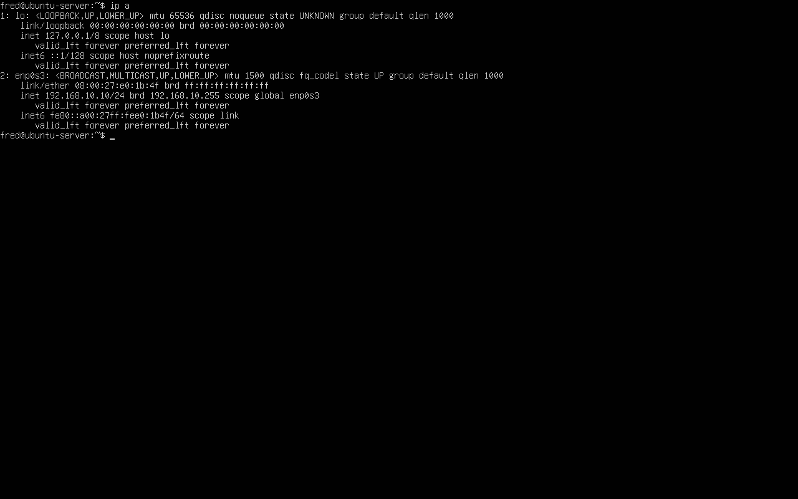
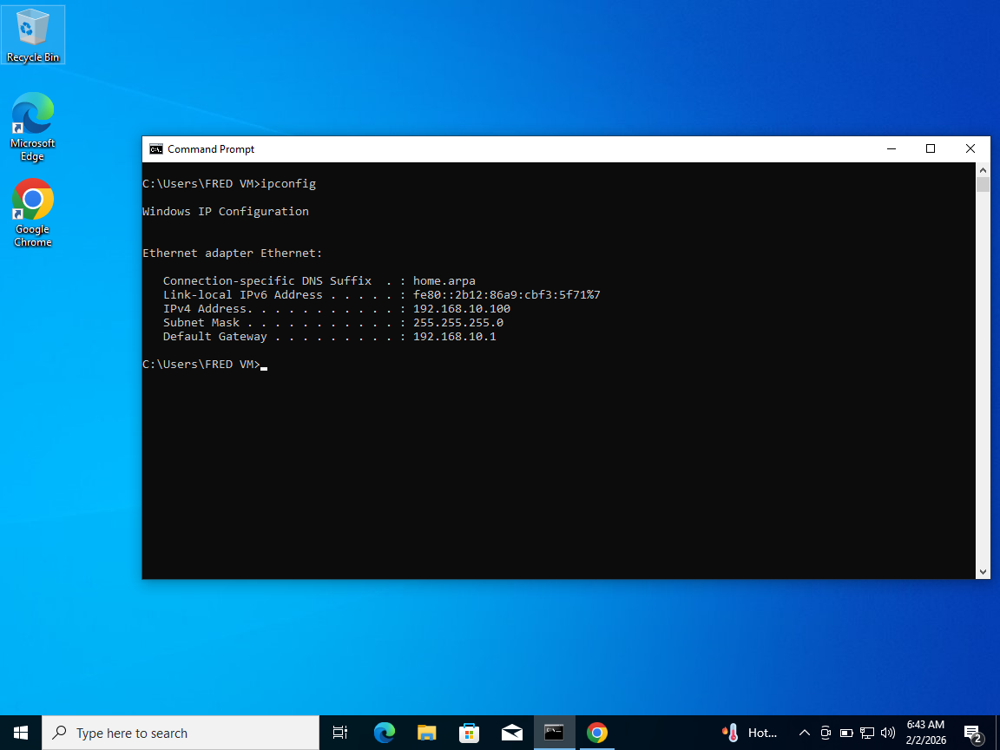
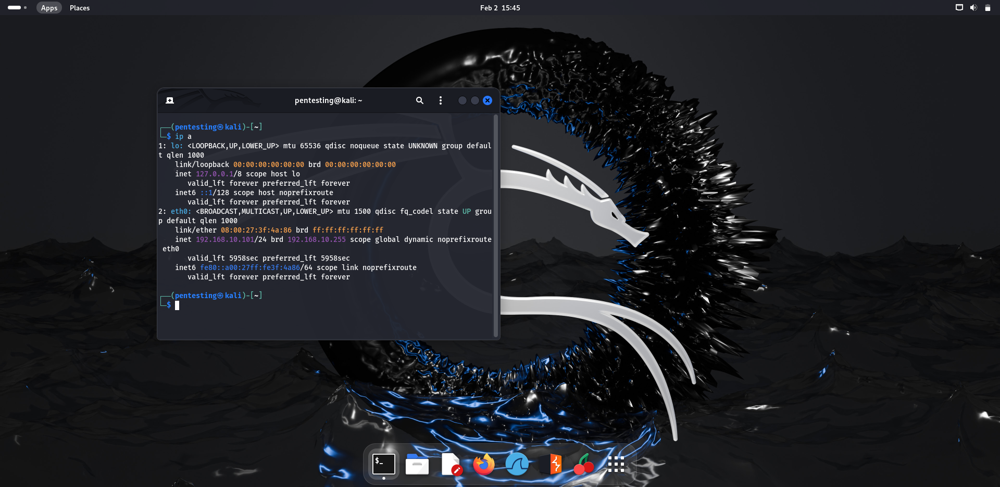

# Day 1 – Networking Basics & Lab Wiring

## Objective
The objective of this lab was to understand how systems communicate
within a small enterprise-style network by designing, wiring,
configuring, and troubleshooting a virtual lab environment.

The focus of this day was on how traffic flows between hosts, how IP
addressing and core services are assigned, and how a firewall operates
as the central communication point.

---

## Lab Environment

### Tools Used
- VirtualBox
- pfSense Community Edition
- Ubuntu Server
- Kali Linux
- Windows 10

---

## Network Design

### Architecture Overview
- pfSense acts as the perimeter firewall and default gateway
- The WAN interface connects to the Internet using VirtualBox NAT
- The LAN interface connects to an isolated Internal Network (`soc_lan`)
- All client machines reside on the same LAN segment

A simple star topology was used, with pfSense positioned at the center
of all internal network communication.

---

## IP Addressing Strategy

| Device | Addressing Method |
|------|-------------------|
| pfSense (LAN) | Static – 192.168.10.1/24 |
| Ubuntu Server | DHCP |
| Windows 10 | DHCP |
| Kali Linux | DHCP |

Static addressing was applied to the firewall LAN interface to ensure a
consistent default gateway. DHCP was intentionally used for endpoint
systems to simplify host management and reduce configuration errors.

---

## pfSense Configuration

### Interface Assignment
- WAN interface configured to obtain an address automatically
- LAN interface configured with a static IP address
- LAN connected to a VirtualBox Internal Network (`soc_lan`)

### pfSense Interface Overview
This setup ensured a clear separation between external and internal
network traffic.

---

### DHCP Configuration

- DHCP server enabled on the LAN interface
- Address pool configured for internal hosts
- pfSense operates as the sole DHCP authority on the network

All client systems successfully received IP addresses, default gateway,
and DNS configuration from pfSense.

---

### DNS Configuration
The pfSense DNS Resolver (Unbound) was enabled to provide centralized DNS
resolution for all LAN clients. This allowed internal systems to resolve
domain names while maintaining visibility and control at the firewall.

---

## Connectivity Verification
### Host IP Verification

**Ubuntu Server**

**Windows 10**

**Kali Linux**

### IP Assignment Verification
All systems successfully obtained IP addresses within the
192.168.10.0/24 subnet, confirming that DHCP was functioning correctly.

---

### Network Connectivity Tests
Connectivity was verified using multiple methods:
- Client-to-firewall communication
- Client-to-client communication
- Client-to-Internet connectivity
- DNS resolution using domain names

These tests confirmed correct routing, gateway configuration, and DNS
functionality across the lab environment.

---

### Traceroute Verification
A traceroute test was performed from Kali Linux to the Ubuntu Server.
The results confirmed that internal traffic remained within the LAN and
did not traverse the WAN or external networks.

---

## Troubleshooting Highlights
During the lab, several real-world issues were encountered and resolved:

- DHCP failures caused by mismatched VirtualBox Internal Network names
- APIPA (169.254.x.x) addresses indicating DHCP unreachability
- LAN interface misconfiguration during pfSense setup
- DNS service conflicts between DNS Resolver and DNS Forwarder

These issues were resolved through systematic Layer 2 and Layer 3
troubleshooting.

---

## Skills Demonstrated
- Network design and segmentation
- Firewall deployment and interface configuration
- DHCP and DNS service implementation
- Virtual switching concepts
- Network troubleshooting methodology
- Technical documentation
