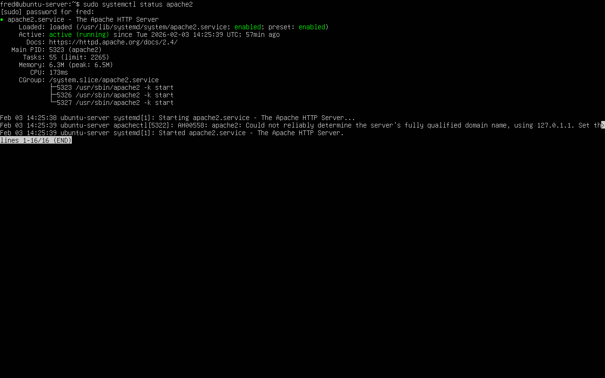
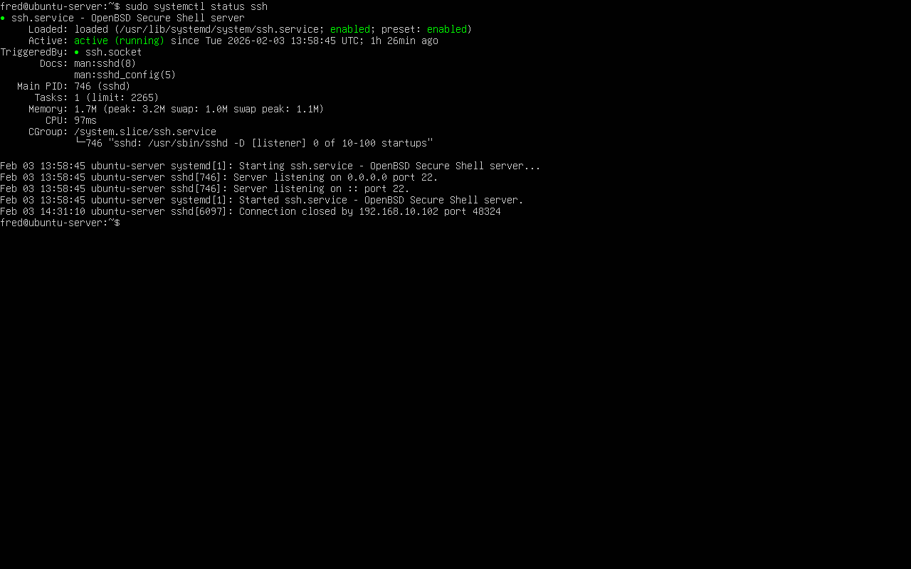
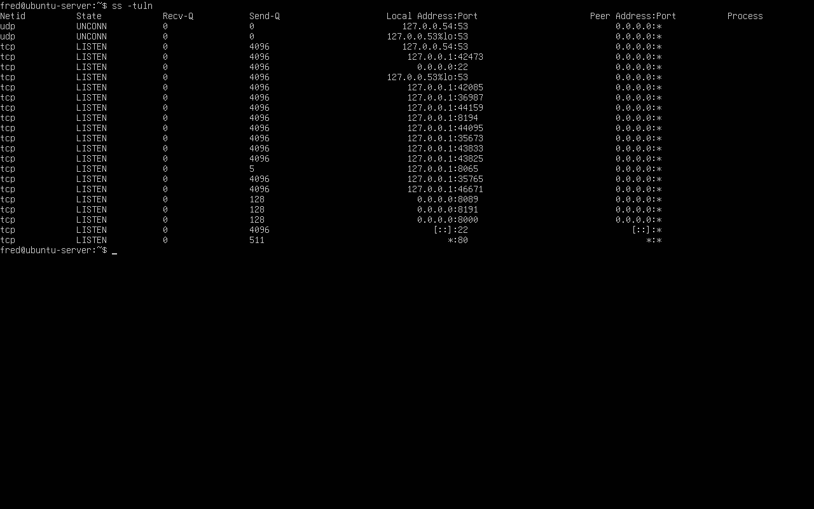
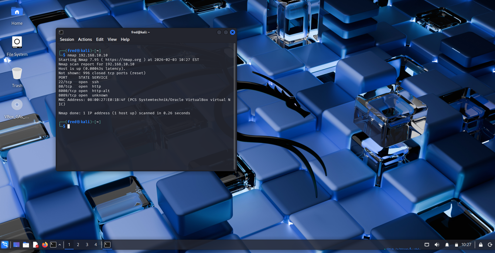
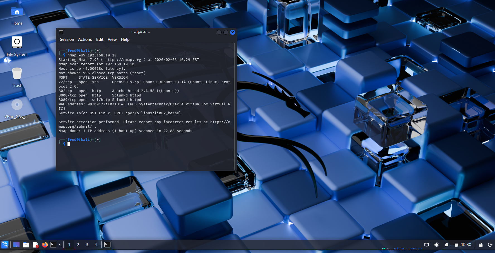
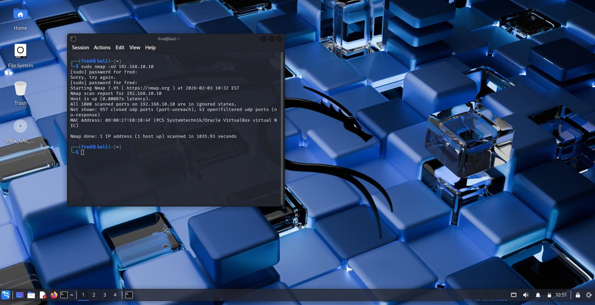

# Day 2 – TCP/IP, Ports & Protocols (Hands-On)

## Goal
The goal of this lab was to understand how network traffic moves between systems by observing how services open ports and how those ports and services can be discovered through scanning.

This lab builds on Day 1, where the network infrastructure and routing were already configured.

---

## Lab Environment

### Virtual Machines Used
- pfSense – Firewall and router
- Ubuntu Server – Target system
- Kali Linux – Scanning and security testing system

All systems were connected to the same internal LAN configured in Day 1.

---

## Services Installed on Ubuntu Server

To simulate a realistic internal server, common network services were installed on the Ubuntu Server. These services expose ports that can be discovered by other systems on the network.

---

### Apache Web Server (HTTP)

- Service: Apache HTTP Server  
- Port: 80  
- Protocol: TCP  

Apache was installed to simulate a web server running inside the network. Web servers are common targets for attackers and are closely monitored by security teams.

---

### SSH Service (Secure Shell)

- Service: OpenSSH  
- Port: 22  
- Protocol: TCP  

SSH was installed to allow remote administration of the Ubuntu Server. SSH is a frequent target of brute-force and credential-based attacks.

---

### Verification of Listening Ports

After installing the services, the Ubuntu Server was checked to confirm that the expected ports were actively listening for connections.

This confirmed that the services were exposed on the network and ready to be scanned.

---

## Port Scanning from Kali Linux

Kali Linux was used to scan the Ubuntu Server from another system on the same network. This simulates how attackers and SOC analysts perform reconnaissance to identify exposed services.

---

### Basic TCP Port Scan

A basic TCP scan was performed to identify open ports on the Ubuntu Server.

---

### Service Detection Scan

A service detection scan was performed to identify which applications were running behind the open ports.

---

### UDP Scan

A UDP scan was performed to observe how UDP-based services behave during scanning. UDP scans are slower and less reliable because UDP does not establish connections like TCP.

---

## Identified Ports and Services

The following ports and services were identified during scanning:

| Port | Protocol | Service | Description | Security Relevance |
|-----|---------|---------|------------|--------------------|
| 22 | TCP | SSH | Remote system administration | Brute-force and credential attacks |
| 80 | TCP | HTTP | Web server traffic | Web application vulnerabilities |

---

## Key Concepts Learned

- Services communicate through specific network ports
- Open ports indicate active and reachable services
- TCP provides reliable, connection-based communication
- UDP is connectionless and more difficult to scan
- Port scanning is a core reconnaissance technique in cybersecurity
- Firewalls and SOC tools rely on visibility into open ports

---

## Skills Demonstrated

- Linux service installation and management
- Understanding of TCP and UDP protocols
- Network reconnaissance using Nmap
- Identification of exposed services
- Security-focused documentation
