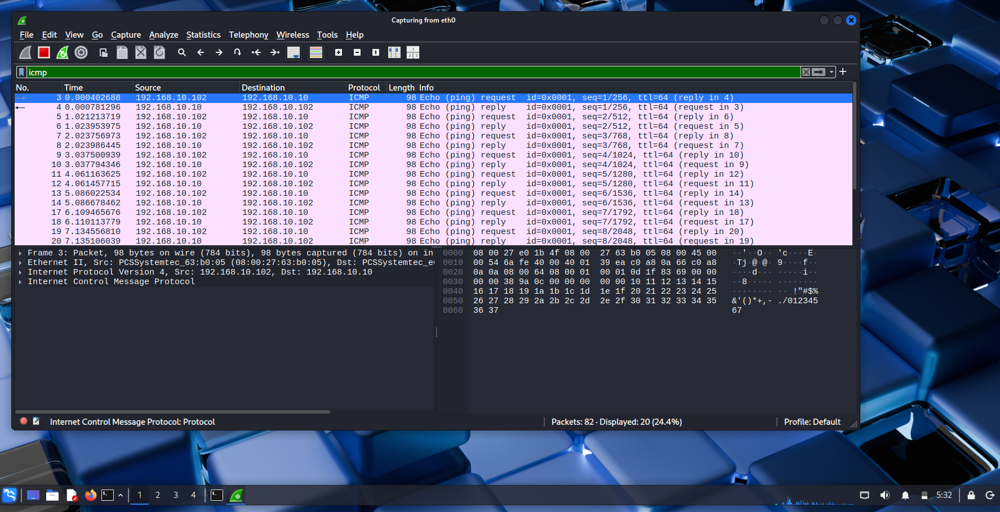
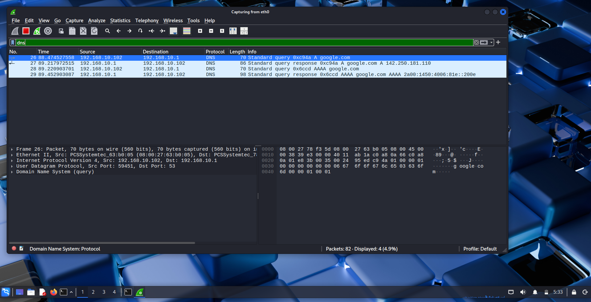
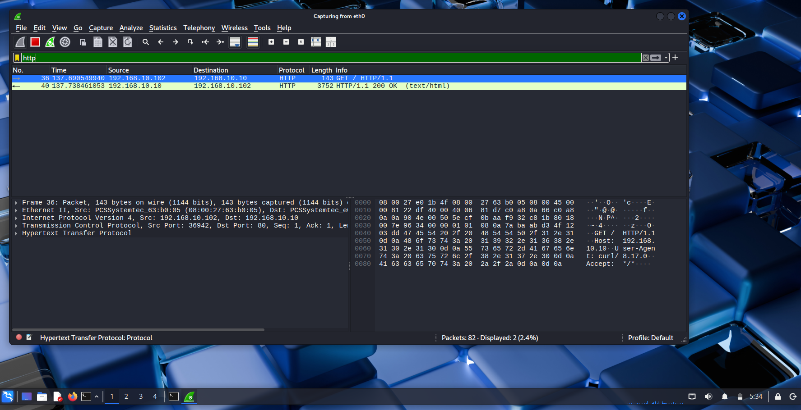
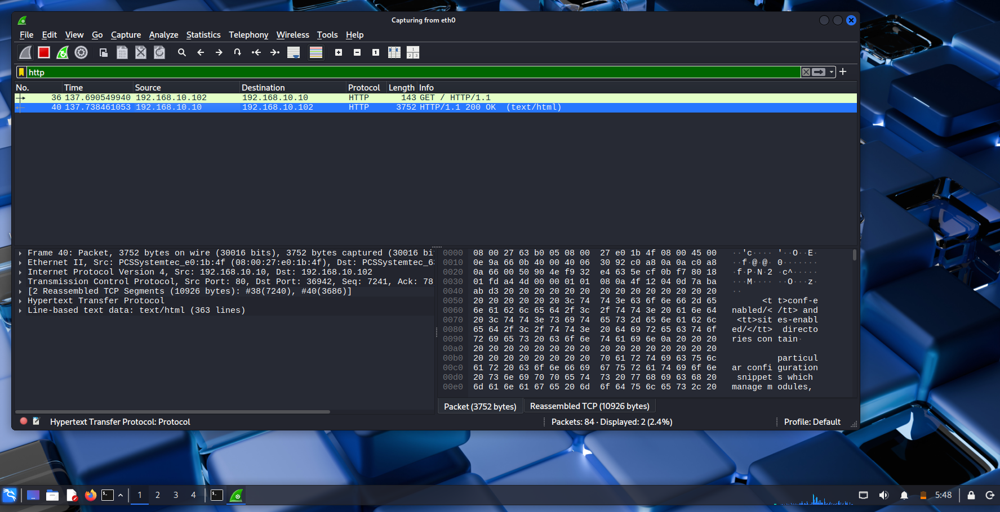
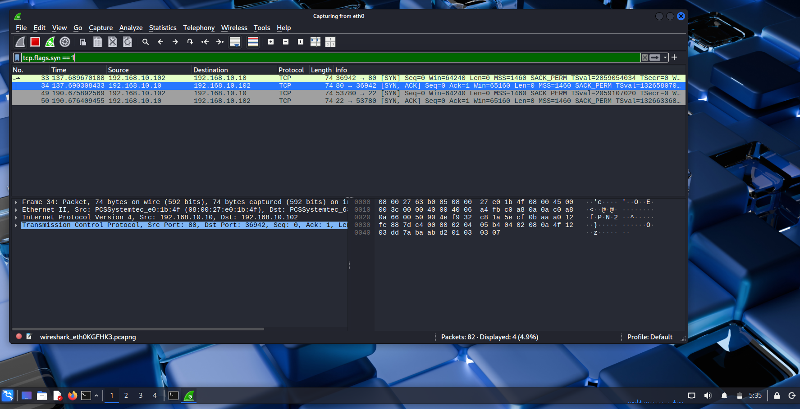
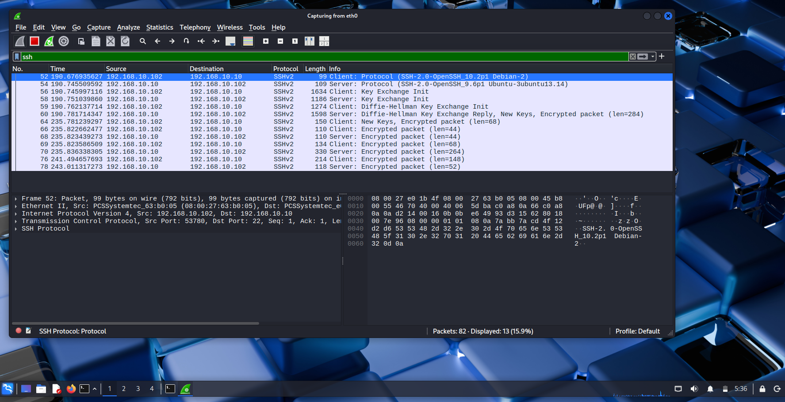

# Day 3 – Wireshark Packet Analysis (Deep Dive)

## Goal
The goal of this lab was to learn how to read and analyze network packets
the way a SOC analyst does by capturing traffic, applying filters, and
identifying key protocol behaviors.

This lab focuses on understanding what normal network traffic looks like
at the packet level.

---

## Lab Environment

### Systems Used
- Kali Linux – Packet capture and analysis system
- Ubuntu Server – Traffic destination
- pfSense – Routing and network control

All systems were connected to the same internal LAN configured in previous labs.

---

## Traffic Capture Overview

Wireshark was used on Kali Linux to capture live network traffic while
different types of communication were generated between systems.

The following traffic types were captured and analyzed:
- ICMP
- DNS
- HTTP
- SSH
- TCP connection establishment

---

## ICMP Traffic Analysis

ICMP traffic was generated using ping to test host reachability.

### What was identified
- ICMP Echo Request
- ICMP Echo Reply

### Why this matters
ICMP is commonly used for network troubleshooting and monitoring.
SOC analysts often examine ICMP traffic to detect scanning or reconnaissance activity.

---

## DNS Request and Response Analysis

DNS traffic was captured during a domain name lookup.

### What was identified
- DNS query for a domain name
- DNS response containing an IP address

### Why this matters
DNS traffic reveals which domains systems are attempting to reach.
This is critical for detecting malicious or suspicious domain activity.

---

## HTTP Traffic Analysis

HTTP traffic was generated by accessing the Apache web server hosted on Ubuntu.

### HTTP GET Request

### HTTP 200 OK Response

### What was identified
- HTTP GET request sent by the client
- HTTP 200 OK response sent by the server

### Why this matters
HTTP traffic is transmitted in clear text.
SOC analysts monitor HTTP traffic to detect data leakage, malicious downloads,
and suspicious web activity.

---

## TCP Three-Way Handshake Analysis

A TCP connection establishment was analyzed to observe the three-way handshake.

### What was identified
- SYN
- SYN-ACK
- ACK

### Why this matters
The TCP three-way handshake confirms that a reliable connection has been established.
This is fundamental to understanding how TCP-based services communicate.

---

## SSH Encrypted Traffic Analysis

SSH traffic was captured during a remote login attempt.

### What was identified
- Encrypted SSH packets
- No readable credentials or payload

### Why this matters
SSH encrypts all traffic, protecting credentials and commands.
SOC analysts verify encryption to ensure secure remote access.

---

## Key Takeaways

- Packet capture provides visibility into network behavior
- Filters allow analysts to focus on relevant traffic
- TCP, UDP, and ICMP behave differently at the packet level
- Unencrypted protocols expose readable data
- Encrypted protocols protect sensitive information

---

## Skills Demonstrated

- Packet capture using Wireshark
- Protocol filtering and analysis
- Identification of normal network behavior
- TCP handshake analysis
- DNS and HTTP packet inspection
- SOC-style documentation
