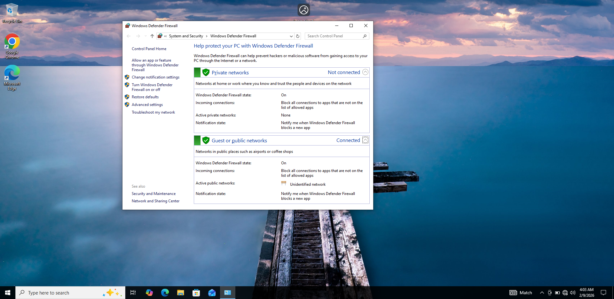
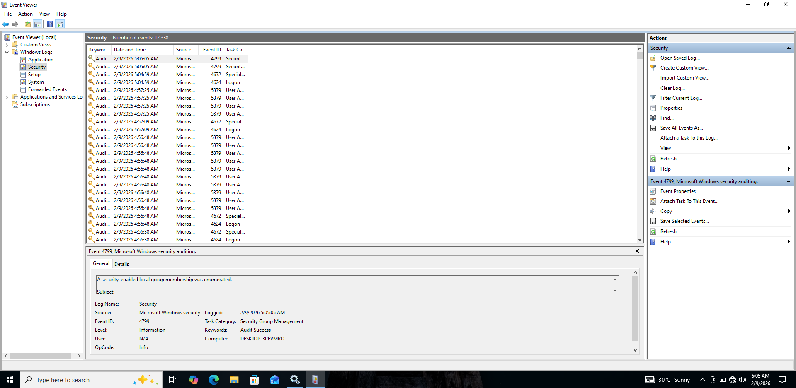
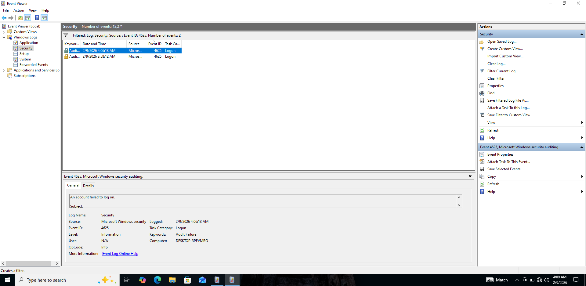
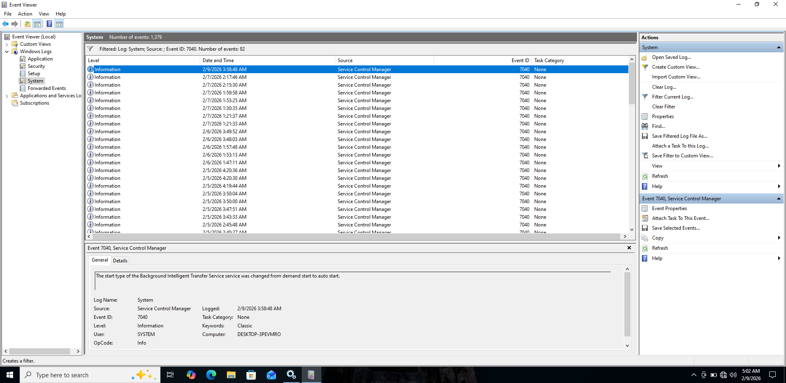

# Day 7 – Windows Security Basics

## Goal
Develop endpoint security awareness by understanding how Windows protects itself
and how security-relevant events are recorded and investigated from a defender’s
(SOC analyst) perspective.

---

## Lab Environment
- Windows 10 (endpoint under investigation)

---

## Task 1 – Windows Firewall Enabled

### Objective
Ensure that the Windows endpoint is protected by an active firewall to control
inbound and outbound traffic.

### Actions Performed
- Verified that Windows Defender Firewall is enabled
- Confirmed firewall protection is active for the system

### Evidence

---

## Task 2 – Accessing Windows Security Event Logs

### Objective
Identify where Windows records authentication and security-related events.

### Actions Performed
- Opened Event Viewer
- Navigated to Windows Logs → Security

### Evidence

---

## Task 3 – Failed Login Detection

### Objective
Generate and identify failed authentication attempts, which are common indicators
of brute-force attacks or unauthorized access attempts.

### Actions Performed
- Performed a failed login attempt using an incorrect password
- Located the corresponding security event in the logs

### Key Event ID
- 4625 – Failed logon

### Evidence

---

## Task 4 – Service Configuration Change Detection

### Objective
Detect system-level changes related to Windows services, which may indicate
administrative actions, misconfigurations, or persistence mechanisms.

### Actions Performed
- Modified a Windows service state
- Investigated the resulting system event

### Key Event ID
- 7040 – Service start type changed

### Evidence

---

## Event ID Summary (Deliverable)

- 4625 – Failed logon attempt
- 7040 – Service configuration change

---

## Defender Takeaways
- Windows Firewall provides essential endpoint protection
- Authentication failures are clearly logged and traceable
- Service changes are recorded and can indicate malicious persistence
- Event Viewer is a critical tool for SOC analysts investigating endpoints
- Event IDs provide fast, reliable context during security investigations

---

## Skills Demonstrated
- Windows endpoint security awareness
- Firewall verification
- Windows Event Viewer navigation
- Authentication failure analysis
- Service change detection
- SOC-style log investigation
