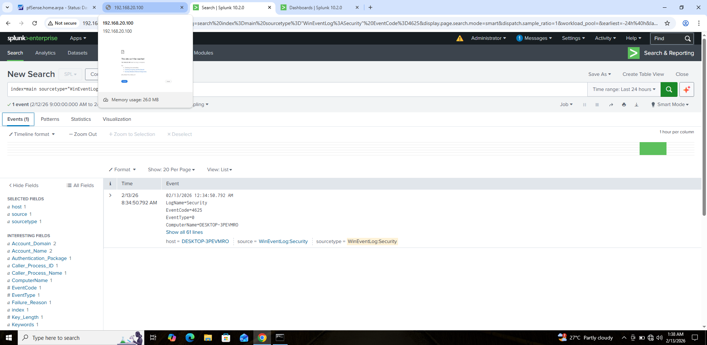
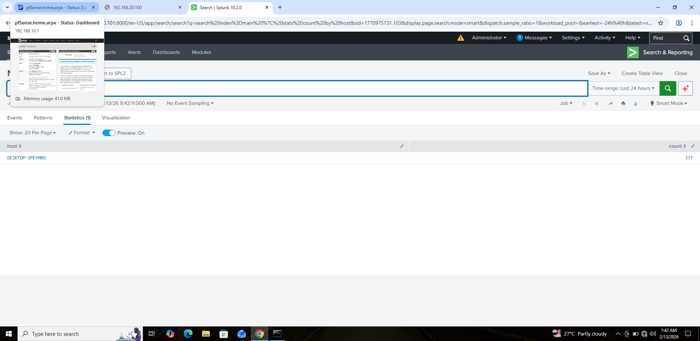
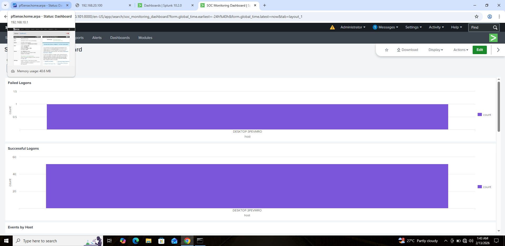

# Day 8 – Centralized Logging (Splunk Setup)

## 🎯 Goal
Implement centralized logging using Splunk Enterprise and Universal Forwarder to simulate a basic SOC monitoring environment.

---

## 🖥️ Lab Architecture

- **Ubuntu Server VM**
  - Splunk Enterprise installed
  - Receiving on port 9997
  - Index: main

- **Windows 10 VM**
  - Splunk Universal Forwarder installed
  - Forwarding Windows Event Logs (Security, System, Application)

---

## ⚙️ Configuration Steps

### 1️⃣ Splunk Enterprise (Ubuntu)
- Installed Splunk Enterprise
- Enabled receiving on port **9997**
- Verified Splunk service is running

### 2️⃣ Splunk Universal Forwarder (Windows)
- Installed Universal Forwarder
- Configured forward server:
  ```
  splunk add forward-server 192.168.20.101:9997
  ```
- Verified active forward connection

### 3️⃣ Log Collection Verified

Successful ingestion of:

- EventCode **4624** → Successful Logons  
- EventCode **4625** → Failed Logons  
- Windows System Logs  
- Windows Application Logs  

---

## 🔎 Searches Used

### Failed Logons
```
index=main sourcetype="WinEventLog:Security" EventCode=4625
```

### Successful Logons
```
index=main sourcetype="WinEventLog:Security" EventCode=4624
```

### Event Count by Host
```
index=main | stats count by host
```

---

## 📊 Dashboard Created

**SOC Monitoring Dashboard** containing:

- Failed Logons Panel (4625)
- Successful Logons Panel (4624)
- Log Statistics by Host

This simulates a basic SOC visibility dashboard for monitoring authentication activity.

---

## 📸 Screenshots

1. Splunk service running (Ubuntu) 

   
2. Forwarder active connection (Windows) 


3. Failed logons search results 

   
4. Successful logons search results 


5. Log statistics by host 

    
6. SOC Monitoring dashboard view 

---

## 🧠 Skills Demonstrated

- SIEM deployment
- Log forwarding configuration
- Windows Event Log monitoring
- SPL querying
- Dashboard creation
- Basic SOC visibility setup

---

## ✅ Outcome

Successfully implemented centralized logging architecture and built a basic SOC monitoring dashboard using Splunk.

This lab simulates real-world log ingestion and monitoring workflow used by SOC analysts.


 
