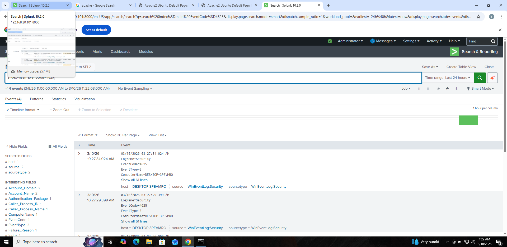

# Day 9 – Log Analysis (SOC Lab)

## Objective
The goal of this lab was to analyze system logs using Splunk in order to detect abnormal behavior and potential security threats such as failed logins, brute-force attempts, and suspicious web activity.

## Environment
SIEM: Splunk Enterprise  
Operating Systems: Windows 10 and Ubuntu Server  
Log Sources:
- Windows Event Logs
- Apache Web Server Logs
- Linux Authentication Logs (SSH)

---

## Activities Performed

### 1. Windows Failed Login Analysis
Windows Security logs were analyzed to detect failed login attempts.

Splunk Query:
index=main EventCode=4625

This query identifies failed authentication attempts in Windows logs.

Screenshot:

---

### 2. Windows Account Login Statistics
To determine which accounts experienced the most failed login attempts, the following query was used.

Splunk Query:
index=main EventCode=4625 | stats count by Account_Name

This helps identify targeted accounts during authentication failures.

Screenshot:
day9_windows_failed_login_stats.png

---

### 3. Apache Web Server Log Monitoring
Apache access logs from the Ubuntu server were ingested into Splunk and analyzed.

Splunk Query:
index=main source="/var/log/apache2/access.log"

This query displays web server access activity including client requests.

Screenshot:
day9_apache_logs_in_splunk.png

---

### 4. Apache Client Activity Analysis
Client activity accessing the Apache server was analyzed to understand traffic patterns.

Splunk Query:
index=main source="/var/log/apache2/access.log" | stats count by host

This shows which systems are interacting with the web server.

Screenshot:
day9_apache_client_ip_analysis.png

---

### 5. SSH Failed Login Detection
SSH authentication logs from Ubuntu were monitored to detect failed login attempts.

Splunk Query:
index=main "Failed password"

This query identifies SSH authentication failures which may indicate brute-force attacks.

Screenshot:
day9_ssh_failed_password_events.png

---

### 6. SSH Attack Source Identification
To identify the source of SSH login attempts, the logs were analyzed further.

Splunk Query:
index=main "Failed password" | stats count

This helps measure the volume of failed login attempts detected in the environment.

Screenshot:
day9_ssh_attacker_ip_detection.png

---

## Outcome
This lab demonstrated how security analysts can use Splunk to monitor and analyze logs from multiple systems to detect suspicious activities. Through log analysis, failed login attempts and potential brute-force behavior were identified across Windows and Linux systems.

The exercise strengthened skills in:
- Log monitoring
- Security event investigation
- Splunk query usage
- Identifying indicators of attack activity
