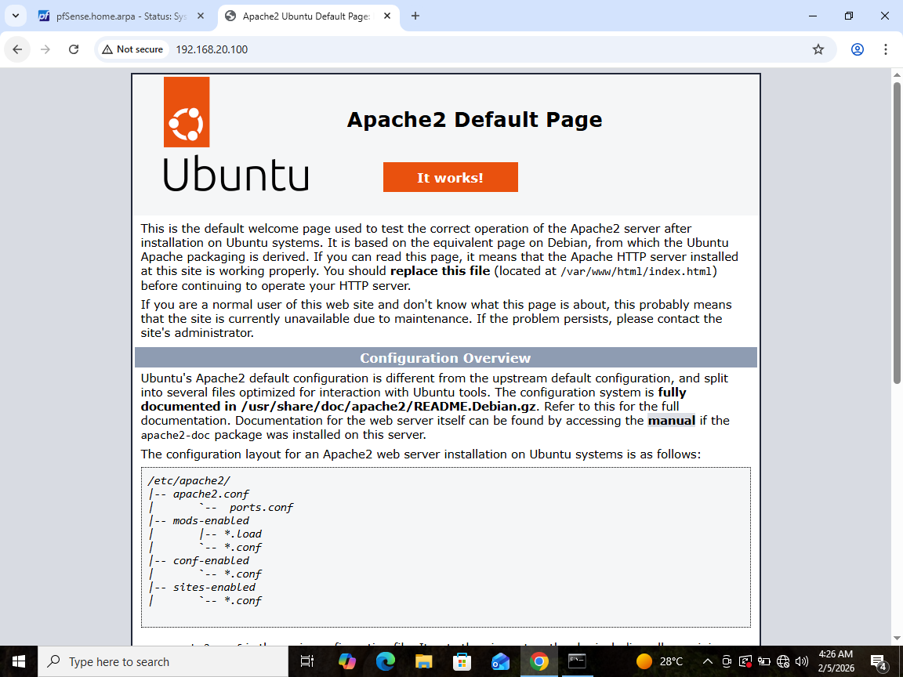

# Day 4 – pfSense Firewall Rules

## Goal
Control network traffic like a defender by enforcing and validating firewall rules using pfSense.

---

## Lab Architecture

This lab uses **network segmentation** with pfSense acting as the firewall and router between two networks:

- **LAN (Users Network): 192.168.10.0/24**
  - Windows 10 (legitimate user)
  - Kali Linux (attacker)

- **OPT1 (Server Network): 192.168.20.0/24**
  - Ubuntu Server (SSH + HTTP services)

pfSense routes traffic between LAN and OPT1 and enforces security policies.

---

## Tasks Completed

- Block **Kali → Ubuntu SSH (TCP 22)**
- Allow **Win10 → Ubuntu HTTP (TCP 80)**
- Verified behavior using:
  - `nmap`
  - `ssh`
  - `curl`
- Confirmed enforcement through **pfSense firewall logs**

---

## Firewall Rules Implemented

| Interface | Action | Source | Destination | Port | Result |
|---------|--------|--------|-------------|------|--------|
| LAN | Block | Kali (192.168.10.102) | Ubuntu (192.168.20.100) | TCP 22 | SSH blocked |
| LAN | Allow | LAN subnet | Ubuntu (192.168.20.100) | TCP 80 | HTTP allowed |
| OPT1 | Default deny | Any | Any | Any | Logged |

---

## Verification and Results

### 1. Kali → Ubuntu SSH Blocked
Command run from Kali:
nmap -p 22 192.168.20.100

Result:
22/tcp filtered ssh
Interpretation:
- SSH traffic is silently dropped by pfSense.
- The service is unreachable from the attacker network.

---

### 2. Win10 → Ubuntu HTTP Allowed
Browser test from Windows 10:
http://192.168.20.100

Result:
- Apache default page loads successfully.

---

### 3. HTTP Verification via curl
Command run from Windows 10:
curl http://192.168.20.100

Result:
- HTML content returned.
- Confirms HTTP access at application level, not just browser caching.

---

### 4. Firewall Log Validation
- pfSense firewall logs show blocked SSH-related traffic.
- Logs confirm rule enforcement and stateful firewall behavior.

---

## Key Takeaways

- Firewall rules are evaluated **per interface and direction**.
- Network segmentation is required for meaningful firewall enforcement.
- Stateful firewalls may log return or dropped traffic differently.
- Verification must combine tools (nmap, curl, logs), not assumptions.

---

## Skills Demonstrated

- Firewall rule creation and validation
- Network segmentation and routing
- Traffic analysis and verification
- pfSense administration
- SOC-style troubleshooting and documentation

## Screenshots

### 1. Kali → Ubuntu SSH Blocked (nmap)

### 2. Win10 → Ubuntu HTTP Allowed (Browser)

### 3. Win10 HTTP Verification via curl

### 4. pfSense Firewall Log – SSH Block

