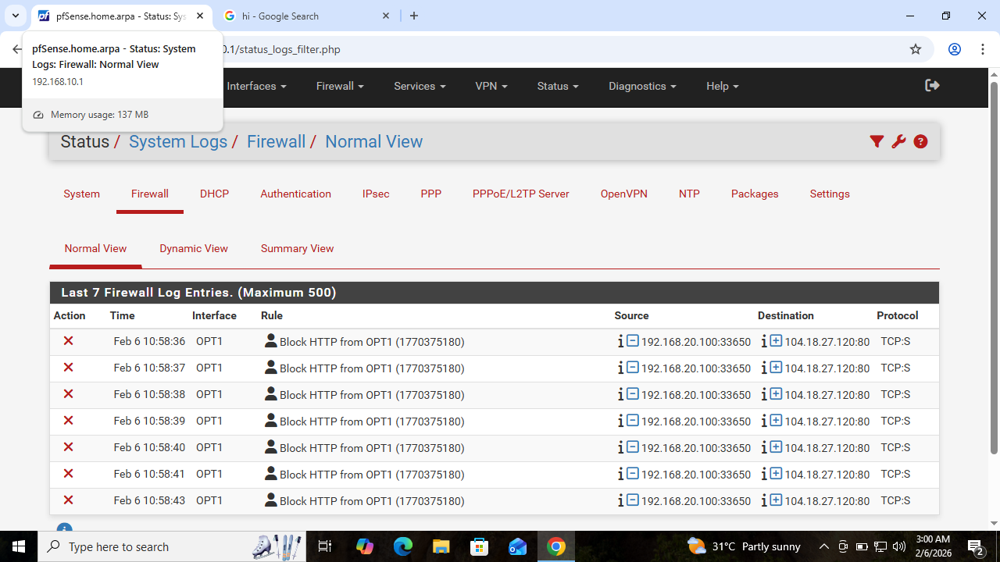
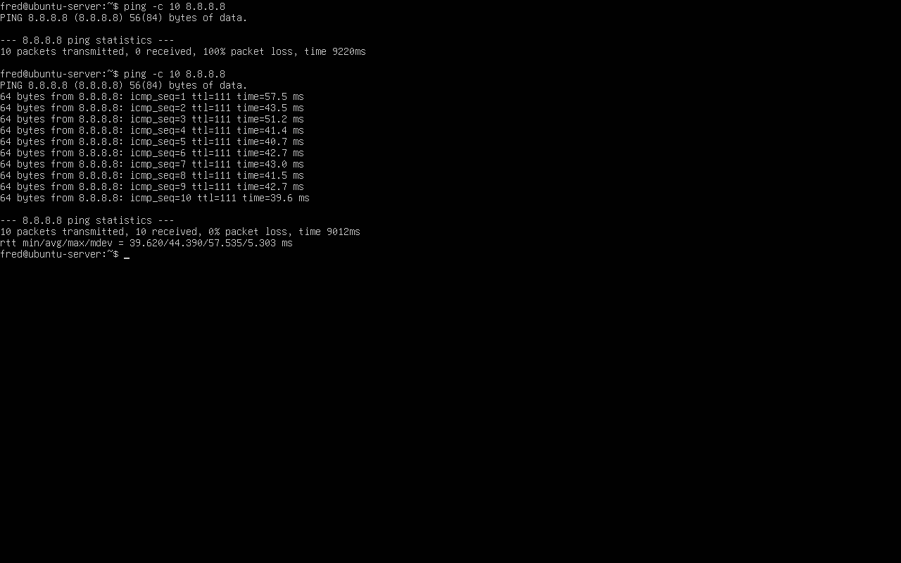

# Day 5 – Network Troubleshooting

## Goal
Practice diagnosing and fixing real network issues using a structured, SOC-style troubleshooting approach.

This lab focuses on identifying root causes instead of guessing, using both host-level tools and firewall logs.

---

## Scenario 1 – DNS Failure (Diagnosed and Fixed)

### Problem
Systems could reach external IP addresses but failed to resolve domain names.

### Diagnosis Approach
- Verified raw connectivity using IP-based ping
- Tested name resolution using `nslookup`
- Identified DNS traffic being blocked by firewall rules
- Confirmed pfSense was the DNS gateway for the server network

### Resolution
- Adjusted firewall rules to allow outbound traffic and DNS (UDP 53)
- Verified successful name resolution after the fix

### Verification Evidence

---

## Scenario 2 – HTTP Blocked by Firewall

### Baseline
HTTP connectivity was confirmed working using `curl`.

---

### Issue Introduced
HTTP traffic (TCP port 80) was intentionally blocked at the firewall.

---

### Diagnosis
Firewall logs confirmed TCP port 80 traffic was being blocked on the OPT1 interface.

---

### Resolution
Firewall rules were reordered and HTTP was explicitly allowed again.

---

## Scenario 3 – Packet Loss Simulation

### Baseline Connectivity
No packet loss observed under normal conditions.

---

### Packet Loss Introduced
ICMP traffic was blocked at the firewall, resulting in 100% packet loss.

---

### Resolution
ICMP blocking rule was disabled and connectivity was restored.

---

## Tools Used
- ping
- nslookup
- curl
- tcpdump
- pfSense firewall logs

---

## Key Takeaways
- Always verify connectivity before assuming service failure
- DNS issues can exist even when IP connectivity works
- Firewall rule order directly affects traffic behavior
- Packet loss can be caused by filtering, not just bad networks
- Logs are essential for accurate root-cause analysis
